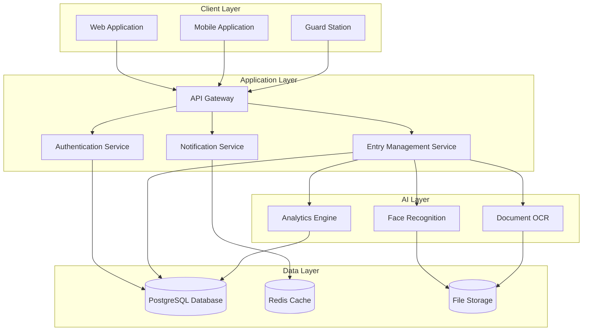
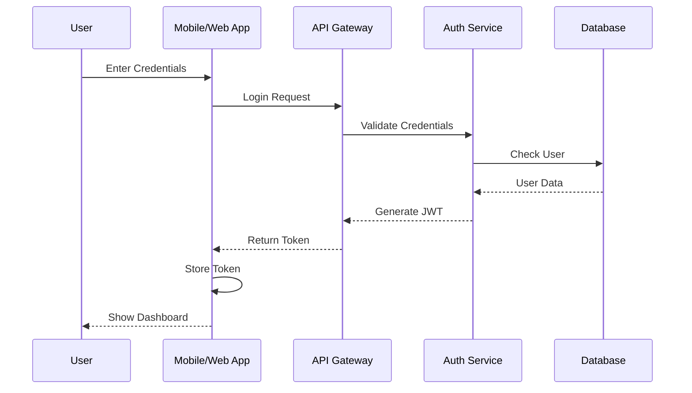
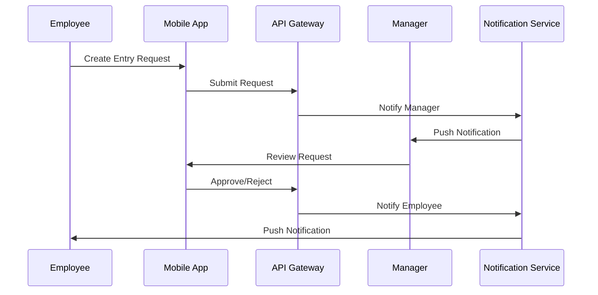
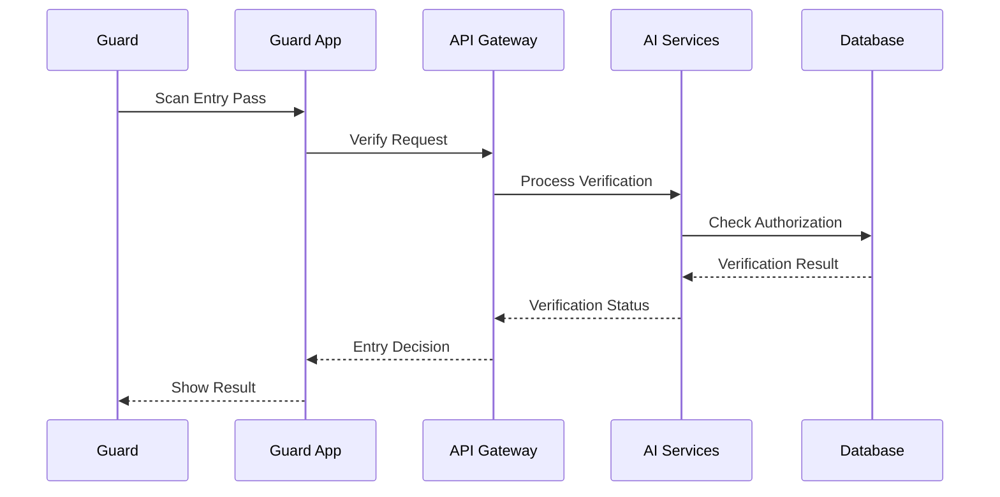
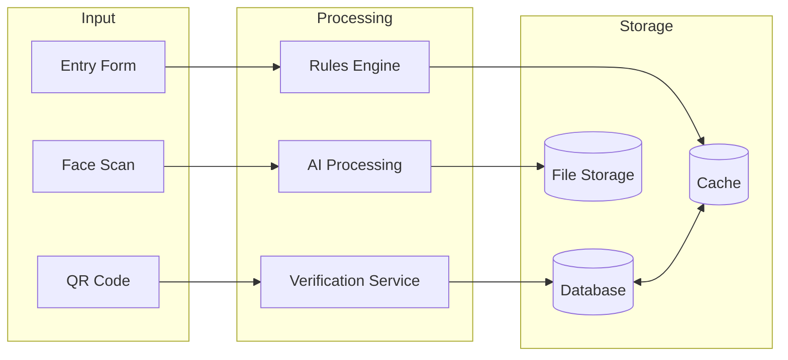
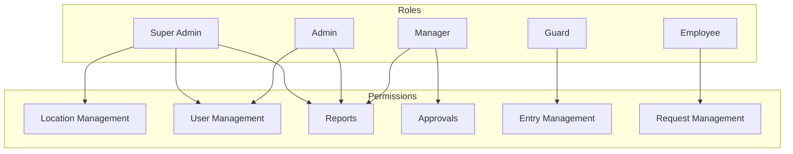
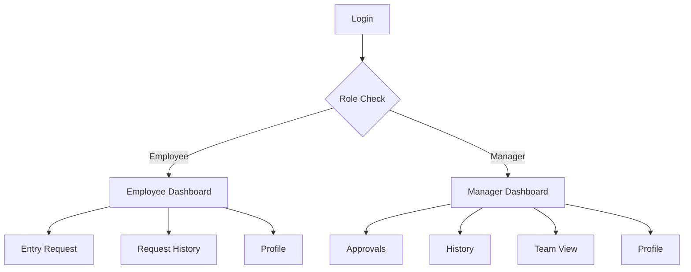
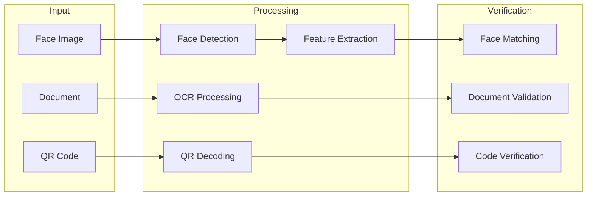
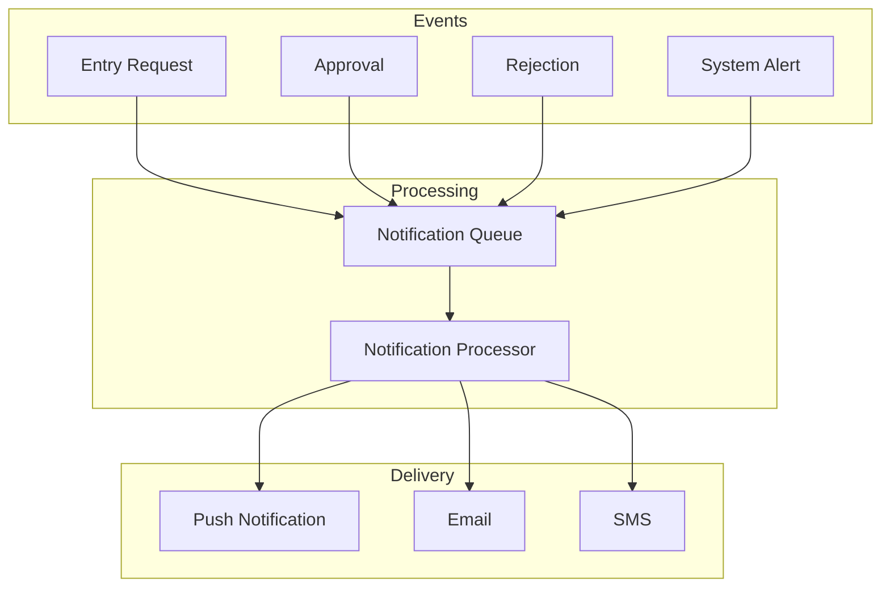

# System Architecture and Flow Diagrams

## System Architecture

## Authentication Flow

## Entry Request Flow

## Guard Verification Flow

## Data Flow Architecture

## Role-Based Access Control

## Mobile App Navigation

## AI Processing Pipeline

## Notification System

These diagrams provide a visual representation of the Entry Management System's architecture and various workflows. They help in understanding:

1. Overall system architecture and component interactions
2. Authentication and authorization flows
3. Entry request and verification processes
4. Data flow between different system components
5. Role-based access control structure
6. Mobile app navigation structure
7. AI processing pipeline
8. Notification system architecture

The diagrams are created using Mermaid markdown syntax, which can be rendered by many modern documentation tools and Git platforms. To view these diagrams properly, ensure your markdown viewer supports Mermaid syntax. 