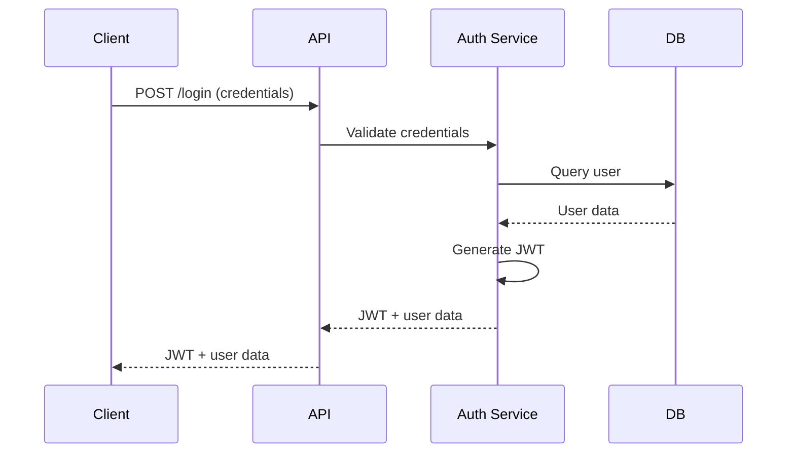

# Entry Management System - Technical Documentation

## Table of Contents
1. [System Architecture](#system-architecture)
2. [API Documentation](#api-documentation)
3. [Component Specifications](#component-specifications)
4. [Data Models](#data-models)
5. [Security Implementation](#security-implementation)

## System Architecture

### High-Level Architecture
```
+------------------------+         +------------------------+
|     Client Layer       |         |     Server Layer       |
|  (React + TypeScript)  |   <->   |    (Node.js + API)    |
+------------------------+         +------------------------+
           ↑                                  ↑
           |                                  |
           ↓                                  ↓
+------------------------+         +------------------------+
|   State Management     |         |    Database Layer     |
|      (Zustand)        |         |      (PostgreSQL)     |
+------------------------+         +------------------------+
```

### Frontend Architecture
```
src/
├── components/           # Reusable UI components
│   ├── common/          # Shared components
│   ├── auth/            # Authentication components
│   ├── dashboard/       # Dashboard components
│   └── layout/          # Layout components
├── pages/               # Page components
│   ├── auth/           
│   ├── superadmin/     
│   ├── admin/          
│   ├── manager/        
│   └── guard/          
├── stores/              # Zustand stores
├── services/            # API services
├── utils/               # Utility functions
└── types/               # TypeScript types
```

### Backend Architecture
```
server/
├── controllers/         # Request handlers
├── models/             # Database models
├── routes/             # API routes
├── middleware/         # Custom middleware
├── services/           # Business logic
├── utils/             # Utility functions
└── config/            # Configuration files
```

## API Documentation

### Authentication Endpoints

#### POST /api/auth/login
```json
{
  "request": {
    "method": "POST",
    "path": "/api/auth/login",
    "body": {
      "email": "string",
      "password": "string"
    }
  },
  "response": {
    "200": {
      "token": "string",
      "user": {
        "id": "string",
        "name": "string",
        "role": "string",
        "email": "string"
      }
    },
    "401": {
      "error": "Invalid credentials"
    }
  }
}
```

### User Management Endpoints

#### GET /api/users
```json
{
  "request": {
    "method": "GET",
    "path": "/api/users",
    "headers": {
      "Authorization": "Bearer {token}"
    },
    "query": {
      "page": "number",
      "limit": "number",
      "role": "string?",
      "location": "string?"
    }
  },
  "response": {
    "200": {
      "users": [
        {
          "id": "string",
          "name": "string",
          "email": "string",
          "role": "string",
          "status": "string",
          "location_id": "string?"
        }
      ],
      "total": "number",
      "page": "number",
      "limit": "number"
    },
    "401": {
      "error": "Unauthorized"
    }
  }
}
```

### Entry Management Endpoints

#### POST /api/entries
```json
{
  "request": {
    "method": "POST",
    "path": "/api/entries",
    "headers": {
      "Authorization": "Bearer {token}"
    },
    "body": {
      "type": "employee | visitor | material",
      "person_id": "string?",
      "person_name": "string?",
      "purpose": "string?",
      "material_id": "string?",
      "description": "string?",
      "quantity": "number?",
      "entry_point": "string"
    }
  },
  "response": {
    "201": {
      "id": "string",
      "type": "string",
      "status": "string",
      "entry_time": "string",
      "created_by": "string"
    },
    "400": {
      "error": "Invalid request data"
    }
  }
}
```

## Component Specifications

### Common Components

#### 1. DataTable
```typescript
interface DataTableProps<T> {
  data: T[];
  columns: {
    field: keyof T;
    headerName: string;
    width?: number;
    renderCell?: (row: T) => React.ReactNode;
  }[];
  loading?: boolean;
  pagination?: {
    page: number;
    limit: number;
    total: number;
    onPageChange: (page: number) => void;
    onLimitChange: (limit: number) => void;
  };
  onRowClick?: (row: T) => void;
  selectable?: boolean;
  onSelectionChange?: (selectedRows: T[]) => void;
}
```

#### 2. StatusBadge
```typescript
interface StatusBadgeProps {
  status: 'active' | 'inactive' | 'pending' | 'approved' | 'rejected';
  size?: 'small' | 'medium' | 'large';
  withDot?: boolean;
}
```

### Form Components

#### 1. EntryForm
```typescript
interface EntryFormProps {
  type: 'employee' | 'visitor' | 'material';
  onSubmit: (data: EntryFormData) => Promise<void>;
  initialData?: Partial<EntryFormData>;
  loading?: boolean;
}

interface EntryFormData {
  type: string;
  person_id?: string;
  person_name?: string;
  purpose?: string;
  material_id?: string;
  description?: string;
  quantity?: number;
  entry_point: string;
}
```

#### 2. UserForm
```typescript
interface UserFormProps {
  mode: 'create' | 'edit';
  onSubmit: (data: UserFormData) => Promise<void>;
  initialData?: Partial<UserFormData>;
  loading?: boolean;
  roles: string[];
  locations: Location[];
}

interface UserFormData {
  name: string;
  email: string;
  role: string;
  location_id?: string;
  team_id?: string;
  status: string;
}
```

## Additional Dummy Data Sets

### 1. Material Entries
```json
{
  "material_entries": [
    {
      "id": "M001",
      "type": "equipment",
      "name": "Dell Laptop",
      "quantity": 5,
      "unit": "pieces",
      "purpose": "New employee onboarding",
      "requested_by": {
        "id": "U003",
        "name": "Mike Johnson"
      },
      "status": "pending",
      "created_at": "2024-03-15T10:00:00Z",
      "expected_delivery": "2024-03-16T14:00:00Z",
      "attachments": [
        {
          "id": "A001",
          "type": "purchase_order",
          "url": "https://example.com/po/12345"
        }
      ]
    }
  ]
}
```

### 2. Access Cards
```json
{
  "access_cards": [
    {
      "id": "AC001",
      "card_number": "12345678",
      "assigned_to": {
        "id": "EMP123",
        "name": "Alice Cooper"
      },
      "access_level": "all_areas",
      "valid_from": "2024-01-01T00:00:00Z",
      "valid_until": "2024-12-31T23:59:59Z",
      "status": "active",
      "last_used": "2024-03-15T09:00:00Z",
      "access_points": ["Main Gate", "Office Floor", "Parking"]
    }
  ]
}
```

### 3. Visitor Passes
```json
{
  "visitor_passes": [
    {
      "id": "VP001",
      "visitor": {
        "name": "Robert Brown",
        "company": "Tech Solutions Inc",
        "id_type": "driving_license",
        "id_number": "DL123456"
      },
      "host": {
        "id": "EMP123",
        "name": "Alice Cooper"
      },
      "purpose": "Client Meeting",
      "valid_from": "2024-03-15T10:00:00Z",
      "valid_until": "2024-03-15T17:00:00Z",
      "access_areas": ["Reception", "Meeting Room 1"],
      "status": "active"
    }
  ]
}
```

### 4. Attendance Records
```json
{
  "attendance_records": [
    {
      "date": "2024-03-15",
      "team_id": "T001",
      "records": [
        {
          "employee_id": "EMP123",
          "name": "Alice Cooper",
          "status": "present",
          "entry_time": "2024-03-15T09:00:00Z",
          "exit_time": "2024-03-15T17:30:00Z",
          "total_hours": 8.5
        }
      ],
      "summary": {
        "present": 15,
        "absent": 2,
        "leave": 3,
        "total": 20
      }
    }
  ]
}
```

## Security Implementation

### 1. Authentication Flow


### 2. Authorization Levels
```typescript
enum Role {
  SUPER_ADMIN = 'super_admin',
  ADMIN = 'admin',
  MANAGER = 'manager',
  GUARD = 'guard'
}

interface Permission {
  resource: string;
  actions: ('create' | 'read' | 'update' | 'delete')[];
}

const RolePermissions: Record<Role, Permission[]> = {
  [Role.SUPER_ADMIN]: [
    { resource: '*', actions: ['create', 'read', 'update', 'delete'] }
  ],
  [Role.ADMIN]: [
    { resource: 'employees', actions: ['create', 'read', 'update', 'delete'] },
    { resource: 'guards', actions: ['create', 'read', 'update', 'delete'] },
    { resource: 'materials', actions: ['read', 'update'] }
  ],
  // ... more role permissions
};
```

### 3. Data Encryption
- All passwords are hashed using bcrypt
- Sensitive data is encrypted at rest using AES-256
- SSL/TLS for all API communications
- JWT tokens with short expiration and refresh token rotation

### 4. Rate Limiting
```typescript
interface RateLimitConfig {
  windowMs: number;  // 15 minutes
  max: number;       // limit each IP to 100 requests per windowMs
  message: string;
  standardHeaders: boolean; // Return rate limit info in the `RateLimit-*` headers
  legacyHeaders: boolean;  // Disable the `X-RateLimit-*` headers
}
```

## UI Component Library Extensions

### 1. Custom Theme Extensions
```typescript
declare module '@mui/material/styles' {
  interface Theme {
    custom: {
      cardGradient: string;
      borderRadius: {
        card: number;
        button: number;
      };
      shadows: {
        card: string;
        dropdown: string;
      };
    };
  }
}
```

### 2. Animated Components
```typescript
interface AnimatedCardProps {
  children: React.ReactNode;
  animation: 'fade' | 'slide' | 'bounce';
  duration?: number;
  delay?: number;
}

interface AnimatedCounterProps {
  value: number;
  duration?: number;
  prefix?: string;
  suffix?: string;
}
```

### 3. Custom Hooks
```typescript
interface UsePaginationProps {
  totalItems: number;
  itemsPerPage: number;
  initialPage?: number;
}

interface UseSearchProps<T> {
  items: T[];
  searchFields: (keyof T)[];
  debounceMs?: number;
}

interface UseFilterProps<T> {
  items: T[];
  filterConfig: {
    field: keyof T;
    type: 'select' | 'date' | 'boolean' | 'text';
    options?: any[];
  }[];
}
```

## Error Handling

### 1. Error Boundary
```typescript
interface ErrorBoundaryProps {
  fallback: React.ReactNode;
  onError?: (error: Error, errorInfo: React.ErrorInfo) => void;
  children: React.ReactNode;
}
```

### 2. API Error Handling
```typescript
interface ApiError {
  status: number;
  message: string;
  code: string;
  details?: Record<string, any>;
}

const errorHandlers: Record<number, (error: ApiError) => void> = {
  400: handleValidationError,
  401: handleUnauthorizedError,
  403: handleForbiddenError,
  404: handleNotFoundError,
  500: handleServerError
};
```

### 3. Form Error Handling
```typescript
interface FormErrorState {
  field: string;
  message: string;
  type: 'required' | 'invalid' | 'server';
}

interface UseFormErrorsResult {
  errors: FormErrorState[];
  setError: (field: string, message: string, type?: string) => void;
  clearError: (field: string) => void;
  clearAllErrors: () => void;
  hasErrors: boolean;
}
```

## Testing Strategy

### 1. Unit Tests
```typescript
describe('UserService', () => {
  it('should create a new user', async () => {
    const userData = {
      name: 'Test User',
      email: 'test@example.com',
      role: 'manager'
    };
    const result = await UserService.createUser(userData);
    expect(result).toHaveProperty('id');
    expect(result.email).toBe(userData.email);
  });
});
```

### 2. Integration Tests
```typescript
describe('Entry Management Flow', () => {
  it('should create and approve material entry', async () => {
    // Create entry
    const entry = await EntryService.createMaterialEntry({
      material_id: 'M001',
      quantity: 5
    });
    
    // Approve entry
    const approved = await EntryService.approveEntry(entry.id);
    expect(approved.status).toBe('approved');
    
    // Verify in database
    const dbEntry = await EntryModel.findById(entry.id);
    expect(dbEntry.status).toBe('approved');
  });
});
```

### 3. E2E Tests
```typescript
describe('Login Flow', () => {
  it('should login successfully with valid credentials', async () => {
    await page.goto('/login');
    await page.fill('input[name="email"]', 'test@example.com');
    await page.fill('input[name="password"]', 'password123');
    await page.click('button[type="submit"]');
    await expect(page).toHaveURL('/dashboard');
  });
});
```

This documentation will be continuously updated as new features are added or existing ones are modified. 